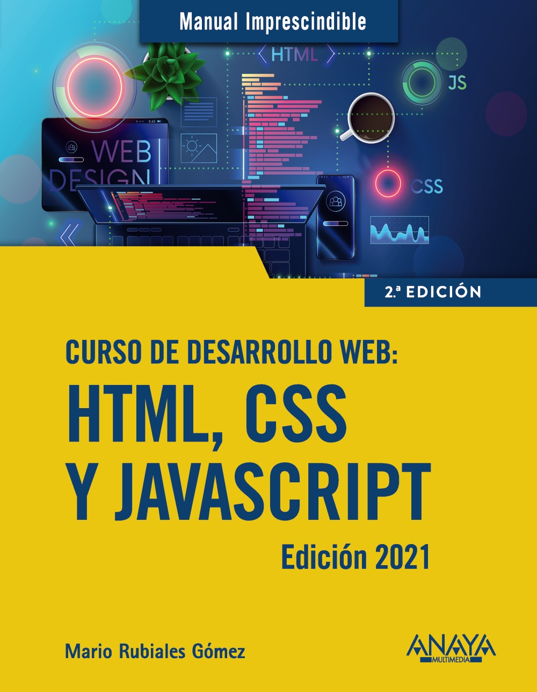

# Curso de desarrollo Web: HTML, CSS y JavaScript (Edición 2021)


## Introducción
En este repositorio encontrarás todos los ejemplos del libro [“Curso de desarrollo Web: HTML, CSS y JavaScript.” de _Anaya Multimedia_](https://anayamultimedia.es/libro/manuales-imprescindibles/curso-de-desarrollo-web-html-css-y-javascript-edicion-2021-mario-rubiales-gomez-9788441544147/).

## Enlaces externos
- HTML
  - [Tutorial de HTML](https://www.w3schools.com/html/default.asp)
  - [Listado de etiquetas HTML](https://www.w3schools.com/tags/default.asp) 
  - [Validación de (X)HTML](https://validator.w3.org/)
- CSS
  - [Tutorial de CSS](https://www.w3schools.com/css/default.asp)
  - [Listado de propiedades CSS](https://www.w3schools.com/cssref/index.php)
  - [Validación de CSS](https://jigsaw.w3.org/css-validator/)
- JavaScript
  - [Tutorial de JavaScript](https://www.w3schools.com/js/default.asp)
  - [Listado de propiedades y métodos de todos los objetos](https://www.w3schools.com/jsref/default.asp)

## Visualización en un contenedor

### Instalación herramientas necesarias
- [Docker Desktop](https://www.docker.com/products/docker-desktop/)

### Construir el contenedor
Mediante la siguiente instrucción se creará un contenedor con la imagen oficial de docker del servidor web apache 2.4 (httpd 2.4) en Alpine Linux (distro ligera de GNU/Linux), y se copiarán los [ficheros de los ejemplos](public). Consulte el [fichero Dockerfile](Dockerfile) para obtener más información.
```
% docker build -t httpd-alpine .
```
Puede consultar la [página de la imagen oficial de docker httpd de Apache HTTP Server Project](https://hub.docker.com/_/httpd) para obtener más información.

### Ejecutar el contenedor
Una vez haya construido el contenedor, podrá ejecutarlo mediante la siguiente instrucción:
```
% docker run -dit --name curso-desarrollo-web -p 8080:80 httpd-alpine
```
En este momento ya podrá [ver los ejemplos en su navegador web preferido](http://localhost:8080/).

### Encontrar el identificador de un contenedor
```
% docker ps
CONTAINER ID   IMAGE          COMMAND              CREATED          STATUS         PORTS                  NAMES
2019348f44f7   httpd-alpine   "httpd-foreground"   10 seconds ago   Up 9 seconds   0.0.0.0:8080->80/tcp   curso-desarrollo-web
```

### Parar un contenedor con su identificador
```
% docker stop 2019348f44f7
```

### Eliminar un contenedor con su identificador
```
% docker rm 2019348f44f7
```

### Parar y eliminar un contenedor con su identificador
```
% docker rm -f 2019348f44f7
```

## Errores y avisos conocidos en la validación del código html
```
% find . -name *.html -exec echo \; -exec echo {} \; -exec tidy -q -e --doctype html5 {} \;
./public/tema-9/codigo1.html
line 27 column 16 - Warning: <a> attribute "href" lacks value
line 27 column 40 - Warning: <a> attribute "href" lacks value
```
